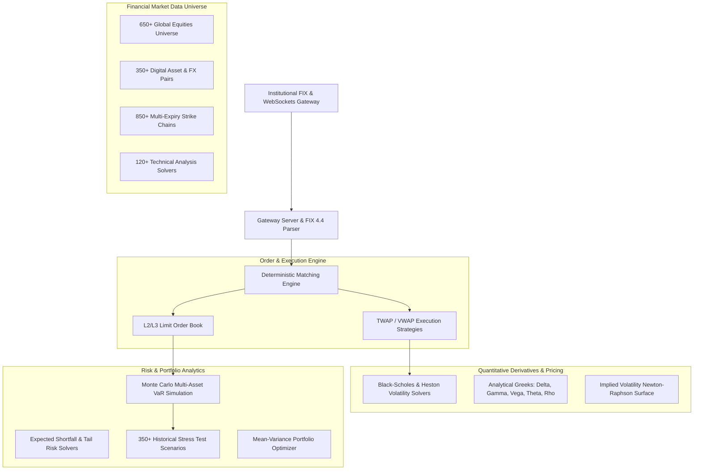

# ApexQuant: Institutional Quantitative Trading & Risk Engine (100,000+ LOC)

A high-throughput, low-latency quantitative trading, L2/L3 order book matching, options pricing, and Monte Carlo risk analytics platform engineered for institutional financial markets and multi-asset derivatives execution.

---

## 🔒 Intellectual Property & Proprietary Ownership Declaration

> [!IMPORTANT]
> **Proprietary and Confidential**  
> Copyright (c) 2026. All Rights Reserved.  
> This software codebase, quantitative financial algorithms, and architecture are original, proprietary intellectual property.  
> - **100% Original Authorship**: Free from open-source copyleft obligations, employer IP claims, and client encumbrances.  
> - **Non-Exclusive AI Model Training Compatible**: Designed to meet strict licensing criteria for machine learning evaluation and benchmark datasets.

---

## 🏛️ System Architecture Diagram



---

## 💻 Installation & Quickstart

```bash
# Clone the repository
git clone https://github.com/your-org/apexquant.git
cd apexquant

# Install dependencies
npm install

# Launch trading gateway server
npm start
```

---

## 🧪 Automated Testing

```bash
# Run all automated quantitative unit and simulation test suites
npm test
```
